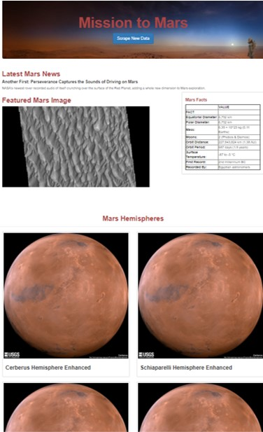

# Mission to Mars
 A web application that scrapes various websites for data related to the Mission to Mars and displays the information in a single HTML page.

 

 ## Data Sources
 Mars data is on the home page /index page is scraped from various sources:
 * [NASA Mars News Site](https://mars.nasa.gov/news/)
 * [Jet Propulsion Laboratory Site](https://data-class-jpl-space.s3.amazonaws.com/JPL_Space/index.html)
 * [Space Facts Site](https://space-facts.com/mars/)
 * [USGS Astrogeology site](https://astrogeology.usgs.gov/search/results?q=hemisphere+enhanced&k1=target&v1=Mars)

## Back End
The flask framework is used to create an app with scrapped data is stored in a MongoDB NoSQL database

## Front End
Front end index.html uses flask html template for rendering.

Bootstrap is used for styling and html structuring.

## Routes
* Home page - '/' served by index.html
* Scrap button - '/scrape' when clicked executes the 'scrape' function defined in the app.py server.

## Running the app
Running app required local MongoDB running with a new mission_to_mars_db created.

Navigate to app.py and run python file to fire up the flask app.

Remember to start the mongoDB on your local machine by typing "mongod" in your command line.

  

